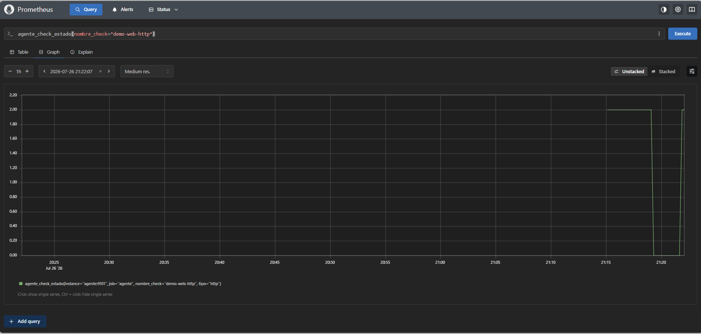

# Fase 1 — Evidencia: detección de caída de `demo-web`

Prueba realizada el 2026-07-25: se detuvo manualmente el contenedor `tfg-demo-web`
(`docker stop tfg-demo-web`) y se comprobó que el agente lo detecta en la siguiente
ronda de checks (intervalo de 30s), sin generar falsos positivos en los checks que no
dependen de `demo-web`.

## 1. Resultados en MySQL (tabla `checks_resultado`)

Antes de parar `demo-web`, los 5 checks estaban en `OK`. Tras pararlo:

| id  | nombre_check   | tipo | estado | latencia_ms | timestamp           |
|-----|----------------|------|--------|--------------|----------------------|
| 105 | ping-demo-web  | ping | CAIDO  | NULL         | 2026-07-25 08:56:19 |
| 104 | cert-google    | ssl  | OK     | 73.5046      | 2026-07-25 08:56:17 |
| 103 | dns-google     | dns  | OK     | 3.84698      | 2026-07-25 08:56:17 |
| 102 | demo-web-tcp   | tcp  | CAIDO  | NULL         | 2026-07-25 08:56:17 |
| 101 | demo-web-http  | http | CAIDO  | NULL         | 2026-07-25 08:56:16 |

Los 3 checks que dependen de `demo-web` (`demo-web-http`, `demo-web-tcp`,
`ping-demo-web`) pasan a `CAIDO`. Los 2 checks independientes (`dns-google`,
`cert-google`, contra `google.com`) siguen en `OK`: el agente distingue correctamente
qué está caído de verdad.

## 2. Métricas expuestas en `/metrics` (leídas por Prometheus)

```
agente_check_estado{nombre_check="demo-web-http",tipo="http"} 2.0
agente_check_estado{nombre_check="demo-web-tcp",tipo="tcp"} 2.0
agente_check_estado{nombre_check="dns-google",tipo="dns"} 0.0
agente_check_estado{nombre_check="cert-google",tipo="ssl"} 0.0
agente_check_estado{nombre_check="ping-demo-web",tipo="ping"} 2.0
```

Convención de valores: `0 = OK`, `1 = DEGRADADO`, `2 = CAÍDO`.

## 3. Captura de Prometheus



Consulta `agente_check_estado{nombre_check="demo-web-http"}` en `http://localhost:9090/graph`.
Se ve claramente el salto a 2.0 cuando se detiene `demo-web`, y la vuelta a 0.0 en cuanto se
reinicia el contenedor — confirma que la detección y la recuperación se reflejan en Prometheus
en tiempo real.

## Conclusión

El agente detecta la caída del servicio en el siguiente ciclo de comprobación
(máximo 30s de retraso, el intervalo configurado en `agente/config.yml`), guarda el
resultado en MySQL con detalle del error, y lo refleja como métrica Prometheus
consultable en Grafana (dashboard pendiente de Fase 2).
