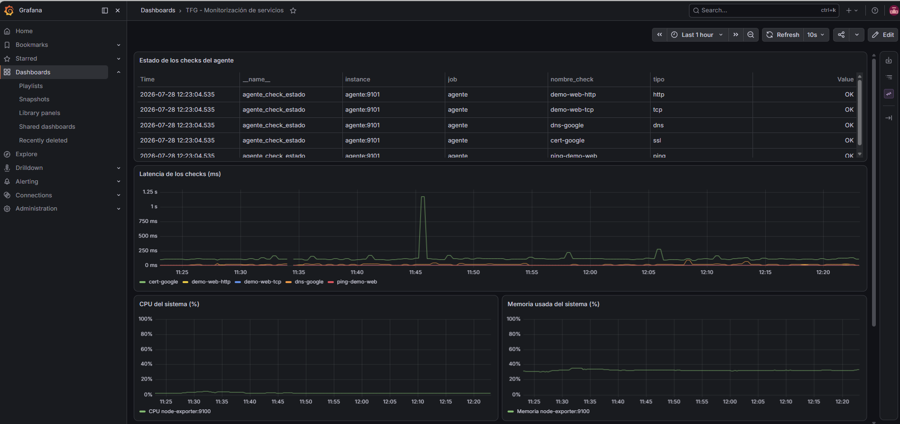

# Fase 2 — Evidencia: motor de reglas y correlación

Prueba realizada el 2026-07-28: se detuvo manualmente `demo-web` y se comprobó que el motor de
reglas (`motor-reglas/`) detecta la condición, abre una incidencia en MySQL (tabla `incidencias`)
con severidad correcta, y la resuelve automáticamente en cuanto el servicio se recupera — sin
intervención manual.

## 1. Incidencias abiertas mientras `demo-web` estaba caído

| id | servicio      | tipo_regla         | severidad   | causa_probable                                          |
|----|---------------|---------------------|-------------|----------------------------------------------------------|
| 2  | ping-demo-web | perdida_paquetes   | advertencia | 40% de los últimos 5 pings a ping-demo-web fallaron     |
| 3  | demo-web-http | caida_consecutiva  | critica     | demo-web-http lleva 3 comprobaciones seguidas en CAÍDO  |
| 4  | demo-web-tcp  | caida_consecutiva  | critica     | demo-web-tcp lleva 3 comprobaciones seguidas en CAÍDO   |

Nótese que se generaron **3 incidencias independientes**, no una sola fusionada: la regla 1
(caída consecutiva) y la señal de pérdida de paquetes no están definidas como una combinación
en `motor-reglas/reglas.yml` (solo `latencia_alta + perdida_paquetes` y `error_5xx + cpu_alta`
se fusionan), así que el motor las trata correctamente como 3 problemas distintos, en vez de
fusionar cosas que no están relacionadas entre sí solo por ocurrir a la vez.

## 2. Resolución automática al reactivar `demo-web`

Tras `docker start tfg-demo-web`, en la siguiente ronda de evaluación (máx. 30s) las 3
incidencias pasaron a `estado = resuelta` con su `resuelto_timestamp` correspondiente, sin
ninguna acción manual sobre la base de datos.

## 3. Prueba de la regla 2 (SSL) y del campo `valor_extra`

De paso se confirmó que el nuevo campo `valor_extra` (añadido en Fase 2 a `checks_resultado`)
guarda correctamente el número de días restantes del certificado SSL (`cert-google` → 54 días)
y el código HTTP (`demo-web-http` → 200), ya con la codificación de acentos corregida
(`charset="utf8mb4"` en la conexión PyMySQL — antes los textos con tildes se corrompían al
guardarse).

## 4. Dashboard de Grafana

Panel provisionado automáticamente (`infra/grafana/dashboards/monitorizacion.json`), sin
configuración manual desde la interfaz de Grafana.

## Conclusión

El motor de reglas evalúa las condiciones cada 30s leyendo MySQL, Prometheus y Docker, y
mantiene el ciclo de vida completo de una incidencia (abierta → resuelta) sin intervención
humana. Las reglas de correlación (5 y 6) están implementadas pero no se han podido disparar
todavía en este entorno de prueba porque requieren condiciones simultáneas (latencia alta +
pérdida de paquetes, o error 5xx + CPU alta) que se validarán con los scripts de la Fase 4.
