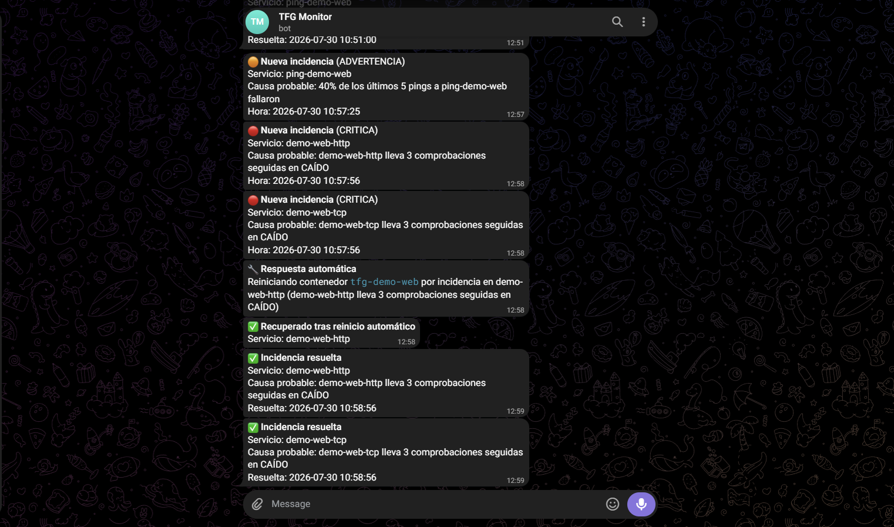

# Fase 3 — Evidencia: notificaciones, respuesta automática y panel

Prueba realizada el 2026-07-30: se detuvo manualmente `demo-web` y, a diferencia de las pruebas
de fases anteriores, **no se reinició a mano** — se dejó que el propio sistema lo detectara,
avisara por Telegram y lo recuperase él solo. Se hizo dos veces: una primera vez que reveló un
bug de reinicio duplicado, y una segunda ya con el bug corregido.

## 1. Primera prueba: bug encontrado (reinicio duplicado)

En la primera ejecución, `demo-web-http` y `demo-web-tcp` (dos checks distintos que apuntan al
mismo contenedor `tfg-demo-web`) generaron dos incidencias independientes, y
`respuesta-automatica` reinició el contenedor **dos veces seguidas**, una por cada incidencia,
sin saber que ya lo había reiniciado segundos antes por la otra. No era un fallo de detección ni
de recuperación (ambas incidencias se resolvieron bien), pero era un reinicio innecesario.

Se corrigió añadiendo una lista de "contenedores ya reiniciados en esta ronda"
(`contenedores_ya_reiniciados` en `respuesta-automatica/main.py`): si dos incidencias de la misma
ronda de evaluación apuntan al mismo contenedor, solo se reinicia una vez.

## 2. Segunda prueba: comportamiento correcto tras el arreglo

Orden de los mensajes recibidos:

1. 🟠 Nueva incidencia (ADVERTENCIA) — `ping-demo-web`, 40% de los últimos pings fallaron.
2. 🔴 Nueva incidencia (CRÍTICA) — `demo-web-http` lleva 3 comprobaciones seguidas en CAÍDO.
3. 🔴 Nueva incidencia (CRÍTICA) — `demo-web-tcp` lleva 3 comprobaciones seguidas en CAÍDO.
4. 🔧 Respuesta automática — reiniciando contenedor `tfg-demo-web` **una sola vez**, por la
   incidencia de `demo-web-http` (la de `demo-web-tcp` ve que el contenedor ya se reinició en
   esta ronda y no repite la acción).
5. ✅ Recuperado tras reinicio automático — `demo-web-http`.
6. ✅ Incidencia resuelta — `demo-web-http` y `demo-web-tcp` (dos incidencias distintas, cada una
   con su propio aviso de resolución — esto sí es correcto: son dos problemas independientes que
   se resolvieron a la vez, no una duplicación).

## 3. Respuesta automática y escalado

`respuesta-automatica/` reinicia el contenedor asociado a la incidencia (mapeo en
`respuesta-automatica/config.yml`), espera 30s y comprueba el último estado del check en MySQL:
- Si vuelve a `OK` → notifica recuperación ("✅ Recuperado tras reinicio automático").
- Si sigue sin responder → notifica escalado ("⚠️ Requiere intervención manual"), sin reintentar
  el reinicio en bucle (cada incidencia solo se atiende una vez, vía la columna
  `respuesta_intentada`).

Esta segunda rama (escalado) no se ha podido probar en este entorno porque `demo-web` siempre se
recupera al reiniciarlo; quedará cubierta con más detalle en los casos de validación de la Fase 4.

## 4. Panel FastAPI

Verificado con `curl`:
- `GET /incidencias` y filtros por `severidad`/`estado` — devuelve el listado correcto.
- `GET /incidencias/{id}` — devuelve una incidencia concreta.
- `GET /incidencias/{id}/informe` — genera el informe post-incidente en texto plano, incluyendo
  la lista completa de checks relacionados en la ventana del incidente (ver ejemplo real de la
  incidencia #4 en el historial de esta sesión de desarrollo).
- `GET /docs` (Swagger UI) responde con código 200.

## Conclusión

El ciclo completo de alerta temprana + respuesta automática funciona de extremo a extremo sin
intervención humana: detección → incidencia → notificación → reinicio → verificación →
recuperación o escalado → resolución de la incidencia → notificación de resolución.
